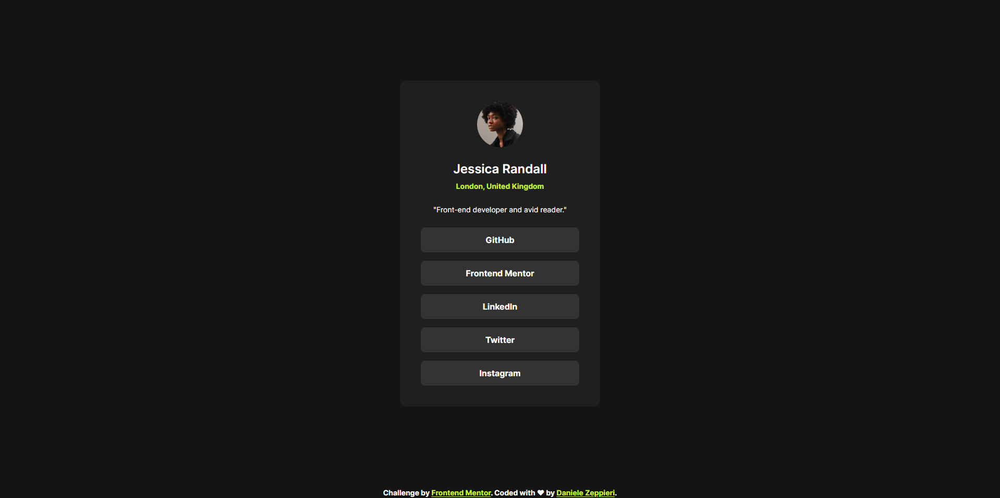

# Frontend Mentor - Social links profile solution

This is a solution to the [Social links profile challenge on Frontend Mentor](https://www.frontendmentor.io/challenges/social-links-profile-UG32l9m6dQ). Frontend Mentor challenges help you improve your coding skills by building realistic projects.

## Table of contents

- [Overview](#overview)
  - [The challenge](#the-challenge)
  - [Screenshot](#screenshot)
  - [Links](#links)
- [My process](#my-process)
  - [Built with](#built-with)
  - [What I learned](#what-i-learned)
  - [Continued development](#continued-development)
  - [Useful resources](#useful-resources)
- [Author](#author)

## Overview

### The challenge

Users should be able to:

- See hover and focus states for all interactive elements on the page.

### Screenshot

### Links

- Solution URL: [Add solution URL here](https://your-solution-url.com)
- Live Site URL: (https://dz-social-links-profile.vercel.app/)

## My process

### Built with

- Semantic HTML5 markup
- CSS custom properties
- Flexbox
- CSS Grid
- Mobile-first workflow
- Custom Properties
- Logical Properties
- BEM

### What I learned

With this challenge I renforced my knowledge and I used in deeper BEM methodology.
I become more confident to set up Custom Properties and working with Logical Properties.

### Continued development

In the future challenges I would like to work Grid and Flexbox, improve my coding skill and learning more Semantic HTML.

### Useful resources

- [CSS Reset by Andy Bell](https://piccalil.li/blog/a-more-modern-css-reset/) - One of the best CSS around the web.

## Author

- Frontend Mentor - [@dedo-dev](https://www.frontendmentor.io/profile/dedo-dev)
- Linkedin - [@daniele-zeppieri](https://www.linkedin.com/in/daniele-zeppieri-0b1a36252/)